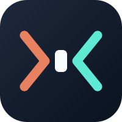

<p align="center">
  
</p>

<h1 align="center">Peer Pressure</h1>

<p align="center">
  <em>Get an independent view from the other agent.</em><br>
  <a href="https://github.com/ahodges22/peer-pressure/actions/workflows/ci.yml"></a>
  
  = 20">
</p>

---

Cross-model consultation, plan review, and code review for **Claude Code and Codex**. The peer is always the agent CLI that is *not* running the skill:

| You are in | Peer agent |
|---|---|
| Claude Code | Codex |
| Codex | Claude Code |

A peer that shares your model can share your blind spots. Peer Pressure keeps the models separate, which means you need **both CLIs installed and logged in**.

## Install

Requirements: Node.js 20+, Codex CLI 0.125.0+, and Claude Code 2.0.0+.

```bash
npm install -g @openai/codex && codex login
npm install -g @anthropic-ai/claude-code && claude   # log in on first run
```

**Claude Code**

```bash
claude plugin marketplace add https://github.com/ahodges22/peer-pressure
claude plugin install adversarial-review@peer-pressure
```

**Codex**

```bash
codex plugin marketplace add https://github.com/ahodges22/peer-pressure
codex plugin add adversarial-review@peer-pressure
```

### Optional Cursor reviewer

Cursor is an optional reviewer override. It is not a plugin host and does not
change the default Claude Code to Codex or Codex to Claude pairing. Request
Cursor explicitly with one supported alias:

```text
composer -> composer-2.5
grok -> cursor-grok-4.5-high
kimi -> kimi-k3-max
glm -> glm-5.2-max
```

Install and authenticate the Cursor Agent CLI:

```bash
curl https://cursor.com/install -fsS | bash
agent login
```

Supported build: `2026.08.04-aaa8809`.

Restore: `agent install 2026.08.04-aaa8809`.

Model diagnostics: `agent --list-models`.

Do not use `agent update` to correct a build mismatch. The reviewer supports
only the listed build until it is re-tested.

Each round starts one Cursor CLI invocation, but a tool-using turn can make
multiple provider calls. Ask mode and Cursor's sandbox enforce read-only
behavior at the CLI level, not an OS read-only boundary. The direct child
timeout is 600 seconds. A descendant retaining an output pipe can keep
`spawnSync` blocked and delay cleanup.

Payload-only Cursor work exposes only an empty temporary workspace.
Repository-context work also grants Cursor read access to the repository. Cursor
rules, skills, notes, transcripts, or MCP configuration in that repository can
influence the session, so use repository context only with repositories whose
Cursor configuration you trust.

## Use

Three skills. Ask for one by name, or describe the task.

```
Ask Claude whether Redis is justified for this service

Run an adversarial plan review on: add rate limiting to the public API

Adversarially review my uncommitted changes
```

- **`consult-peer`** gets one independent, non-binding opinion from the other agent. The host states its initial assessment first, then sends one neutral question without its conclusion or the user's preferred answer. Consultation is payload-only: no repository context is passed, and the peer prompt forbids tool use.
- **`plan-review`** drafts a plan, adds a required `Scope / Out of scope` section, sends the plan for critique, fixes findings, and repeats until approved.
- **`code-review`** runs the same loop over a git diff (uncommitted, staged, or against a branch) and keeps findings tied to the change intent.

Consultation handles one focused question at a time. It refuses to transmit credentials, tokens, private keys, personal data, customer content, or other sensitive context. A successful consultation uses one peer request. Only a runtime-marked transient failure permits one identical retry.

Both review skills stop for your input every 3 rounds and use a host-native prompt for each decision. If more than 50% of a round's findings are out of scope, the skill stops early and asks whether to continue.

Findings are merge-blocking only. Out-of-scope suggestions get rejected by default, so the loop is built to converge instead of bikeshed.

> **Cost:** each consultation and every review round sends a model request through the peer CLI and can use the peer account's quota. Review loops have no hard iteration limit. They run until approval or until you stop them at a checkpoint. `detect`, `inspect-repo`, and `new-ctx` do not send a review or consume model tokens. `detect` runs a local version check and can probe `--help` for required flags.

## License

MIT - see [LICENSE](./LICENSE).
